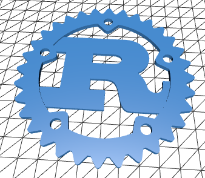
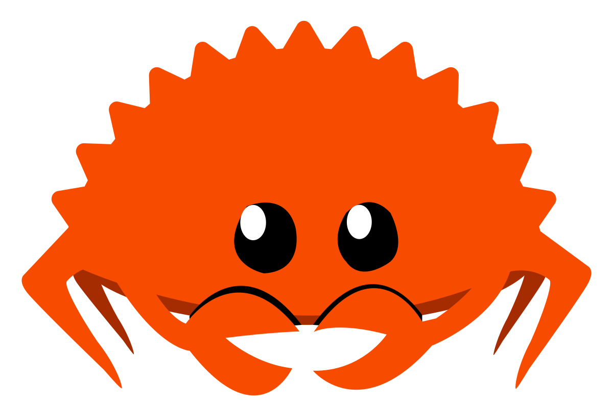
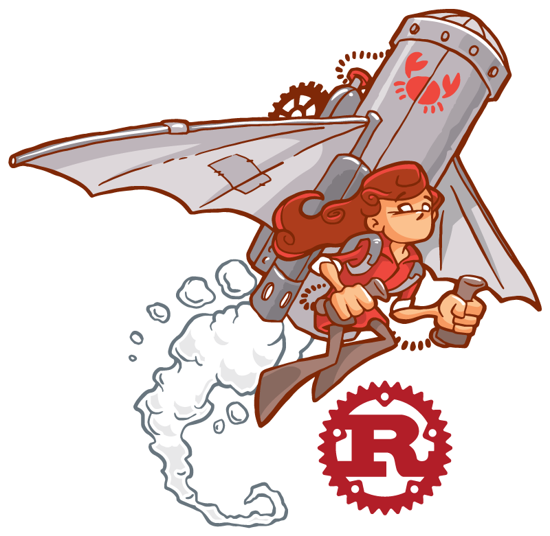
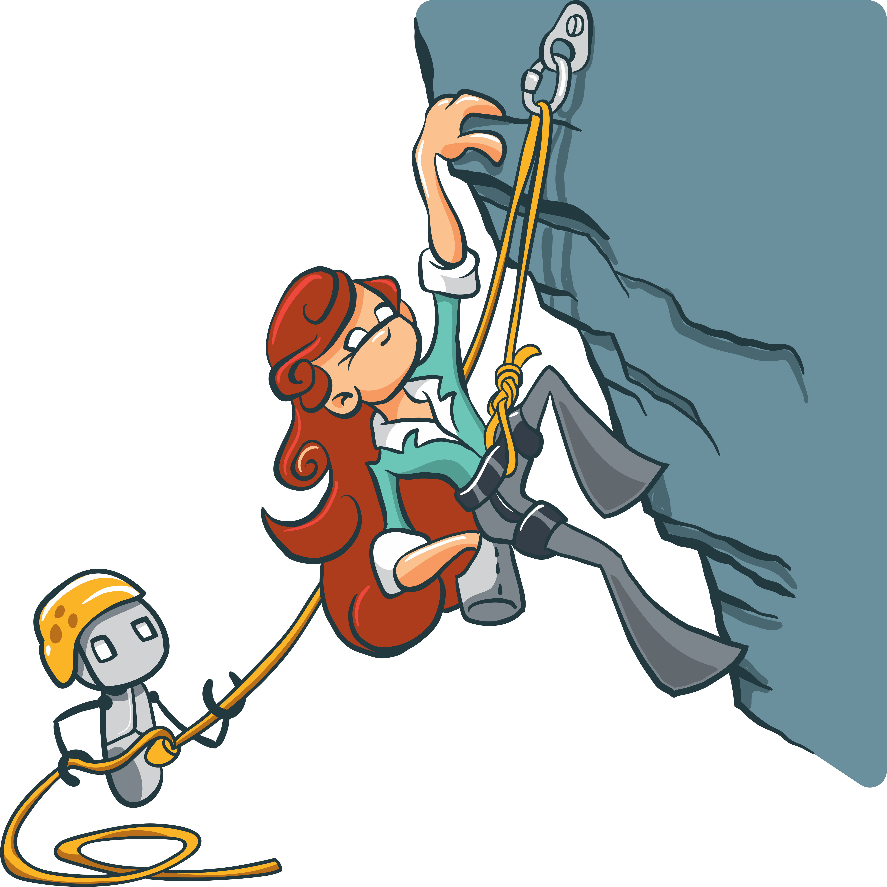
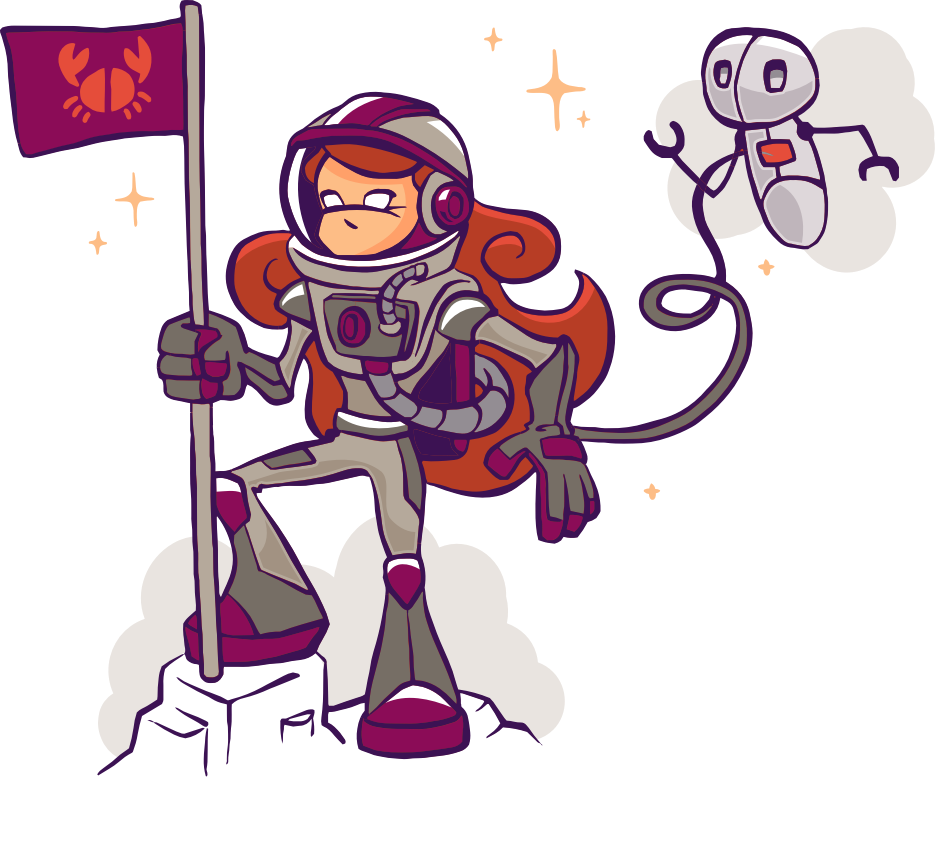

# Rust Artwork

This is a collection of artwork related to the Rust Programming Language,
including the official logo of Rust itself.

Each directory has its own license for the artwork it contains.
Please check the `README.md` file in each directory for details.

## Rust Logo

The [logo/](logo/) directory contains various versions the official Rust logo.

## Mascot

The [mascot/](mascot/) directory contains the original drawings of Ferris and
Corro, the unofficial Rust mascots, by Karen Rustad Tölva.
See https://rustacean.net/.

## RustConf 2017–2019

The [rustconf/](rustconf/) directory contains
artwork that was designed for RustConf 2017 through 2019.
