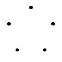
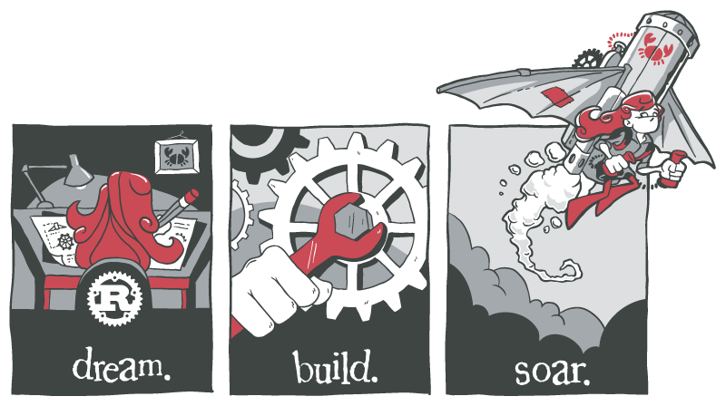

# rust-artwork

This is a collection of artwork related to the Rust Programming Language,
including the official logo of Rust itself.

Each directory has its own license for the artwork it contains.

# Rust Logo

The [logo/](logo/) directory contains various versions the official Rust logo.

# RustConf 2017–2019

The [rustconf/](rustconf/) directory contains
artwork that was designed for RustConf 2017 through 2019.
