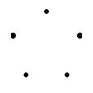
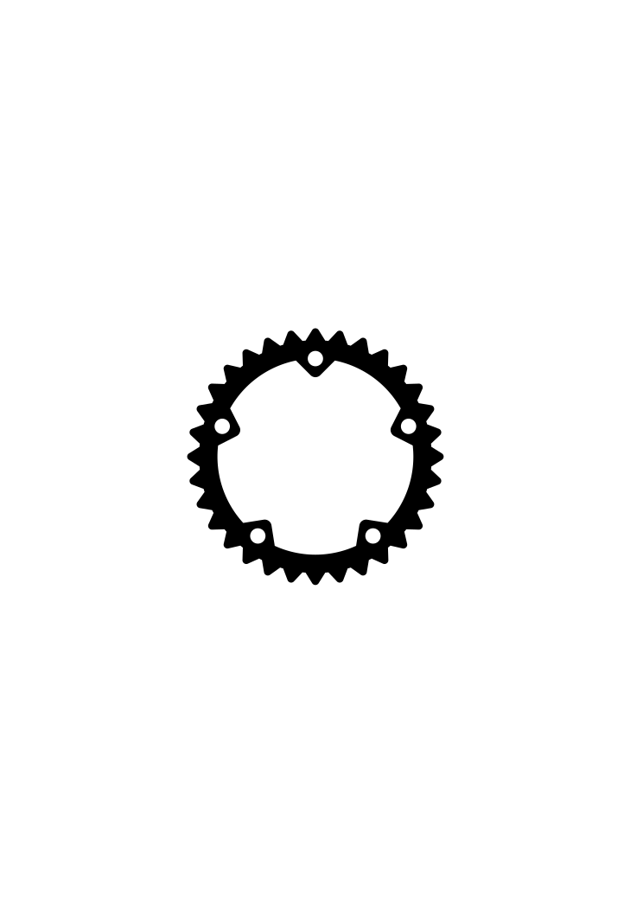
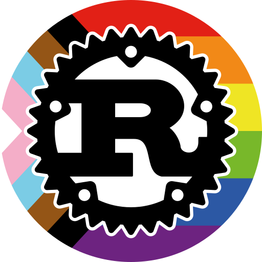

# Rust Logo

The `svg` files with `single-path` in the name use only a single `<path>` element
and no advanced svg features.

## Copyright

The Rust logo is distributed under the terms of the [Creative Commons
Attribution license (CC-BY)][CC-BY]. This is the most permissive
Creative Commons license, and allows reuse and modifications for any
purpose. The restrictions are that distributors must “give appropriate
credit, provide a link to the license, and indicate if changes were
made”.

[CC-BY]: https://creativecommons.org/licenses/by/4.0/

However, note that uses of the Logo must also abide by the trademark rules,
described below.

## Trademark

**Note that the Rust logos, and the Rust and Cargo names, is also
are registered trademarks.**
Our trademark policy is [described in
full on the Rust Foundation website][legal], but the summary is as follows:

[legal]: https://rustfoundation.org/policy/rust-trademark-policy/

> Most non-commercial uses of the Rust/Cargo names and logos
> are allowed and do not require permission; most commercial uses
> require permission. In either case, the most important rule is that
> uses of the trademarks cannot appear official or imply any
> endorsement by the Rust project.

If you would like to use the artwork in a way that is not covered by the
trademark rules given above, it may still be permitted; e-mail
`trademark@rust-lang.org` to ask permission.
