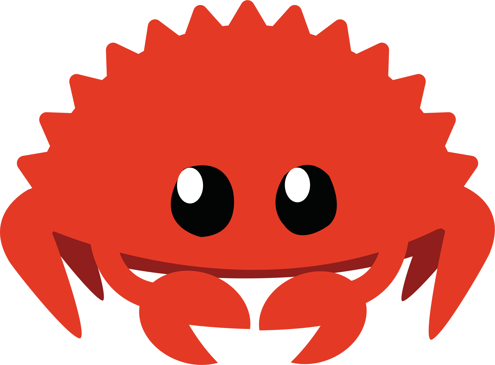
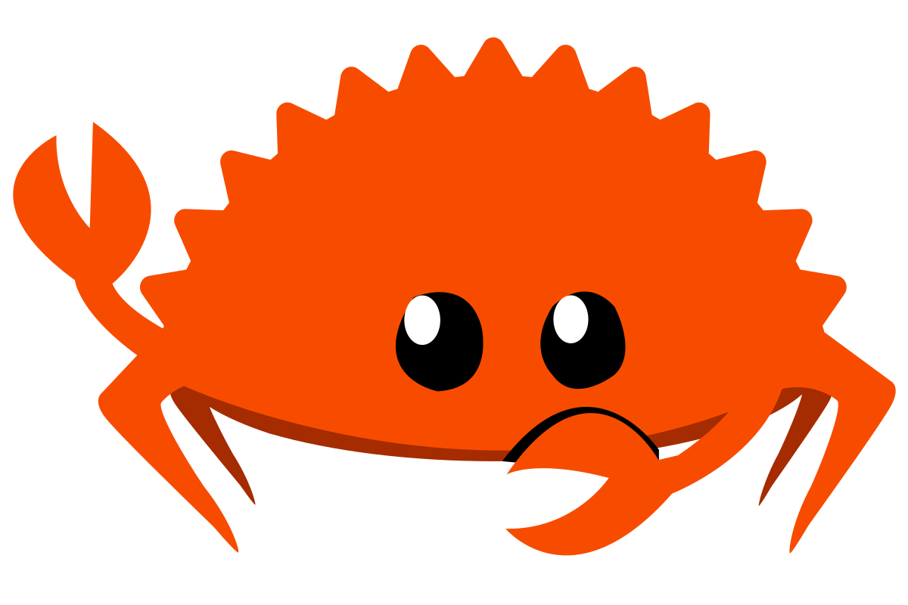

# Ferris and Corro

These drawings were made by Karen Rustad Tölva and are published on https://rustacean.net/.
They are archived here in this repository because of their importance to the Rust community.

## License

Quoting the footnote on https://rustacean.net/:

> To the extent possible under law, Karen Rustad Tölva has waived all copyright
> and related or neighboring rights to Ferris the Rustacean. This work is
> published from: United States.
