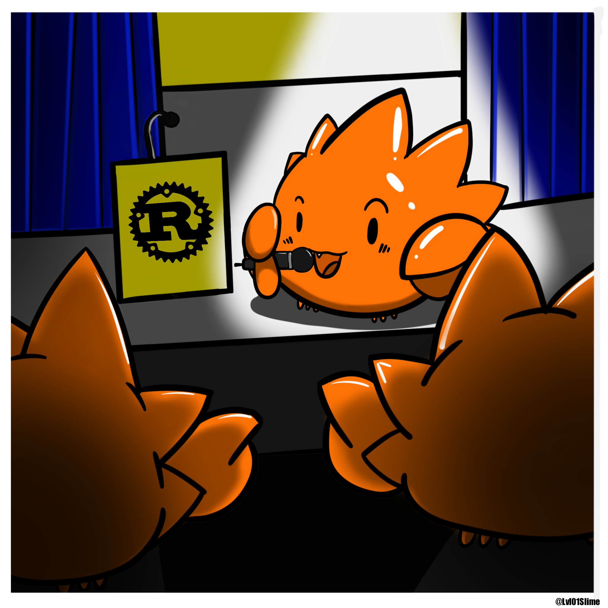
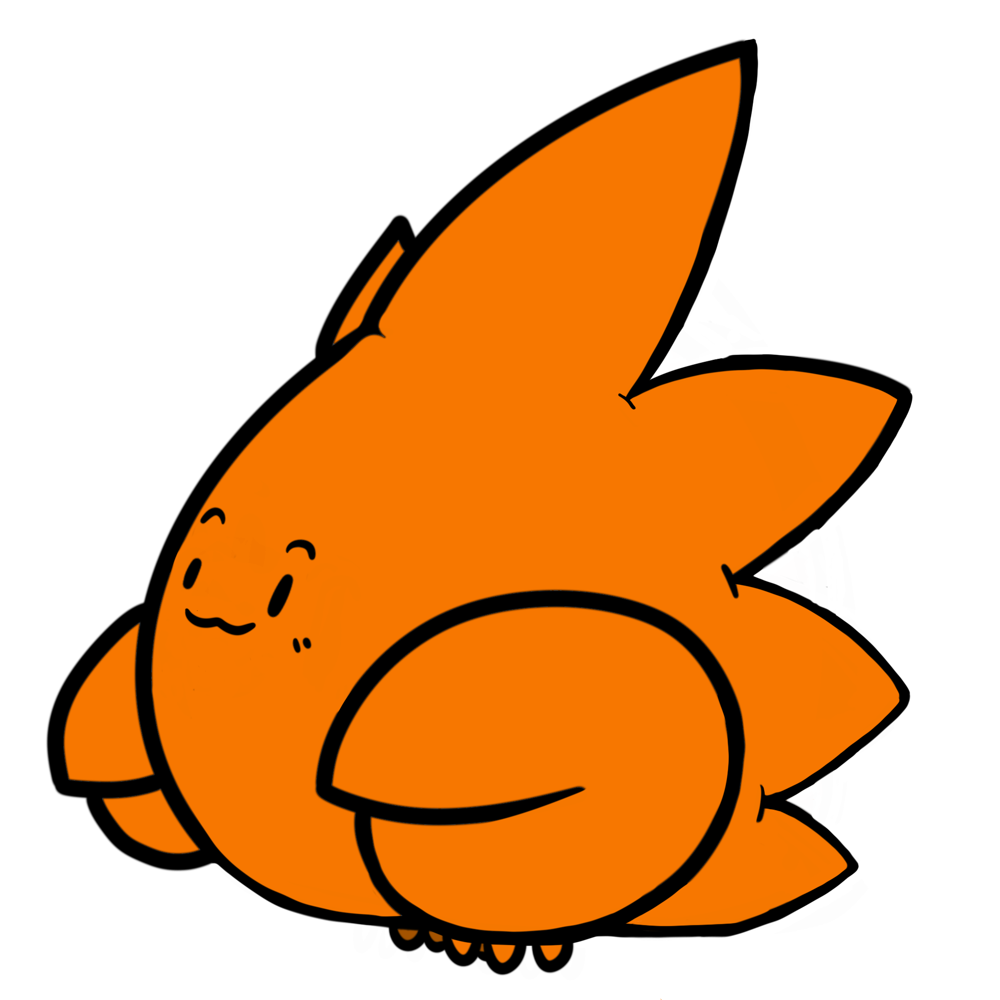
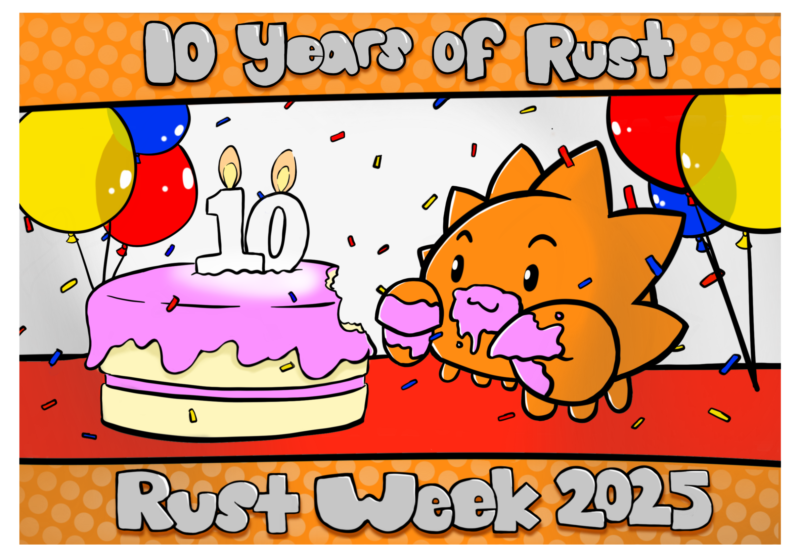
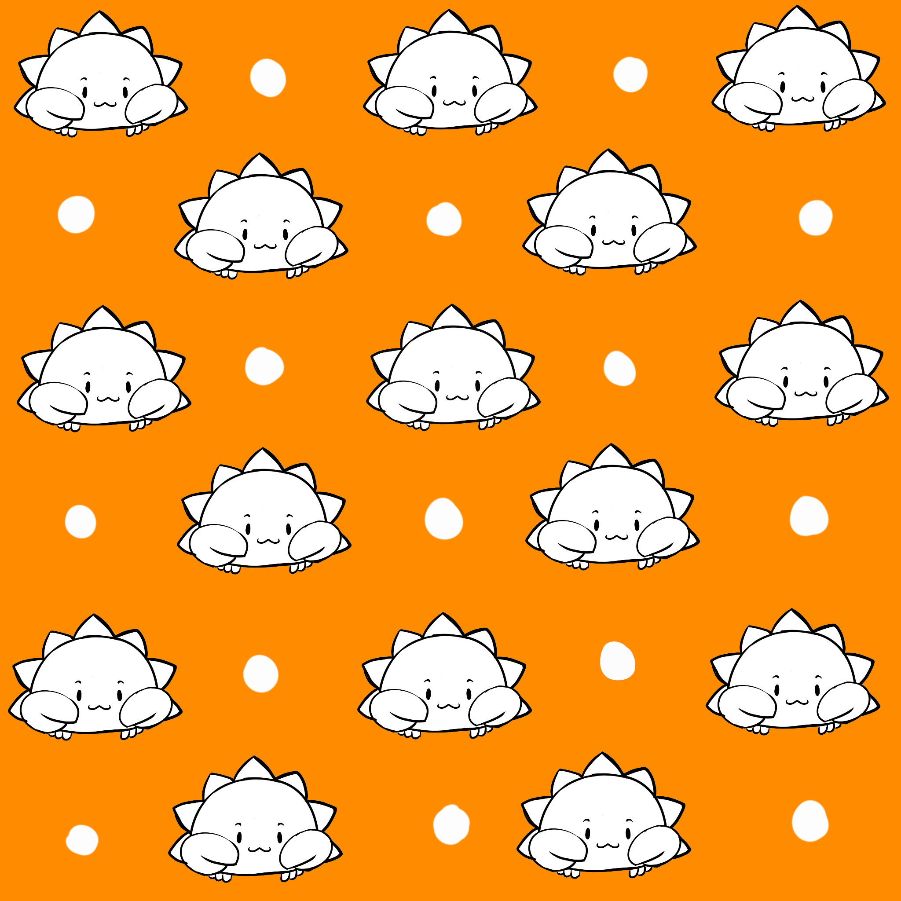
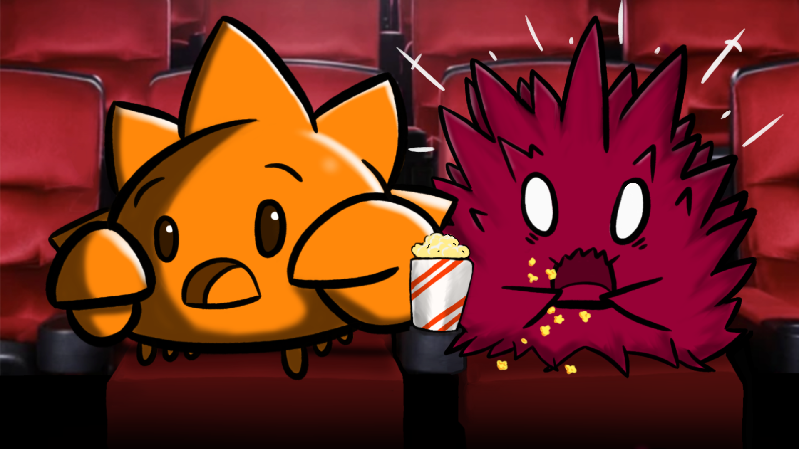
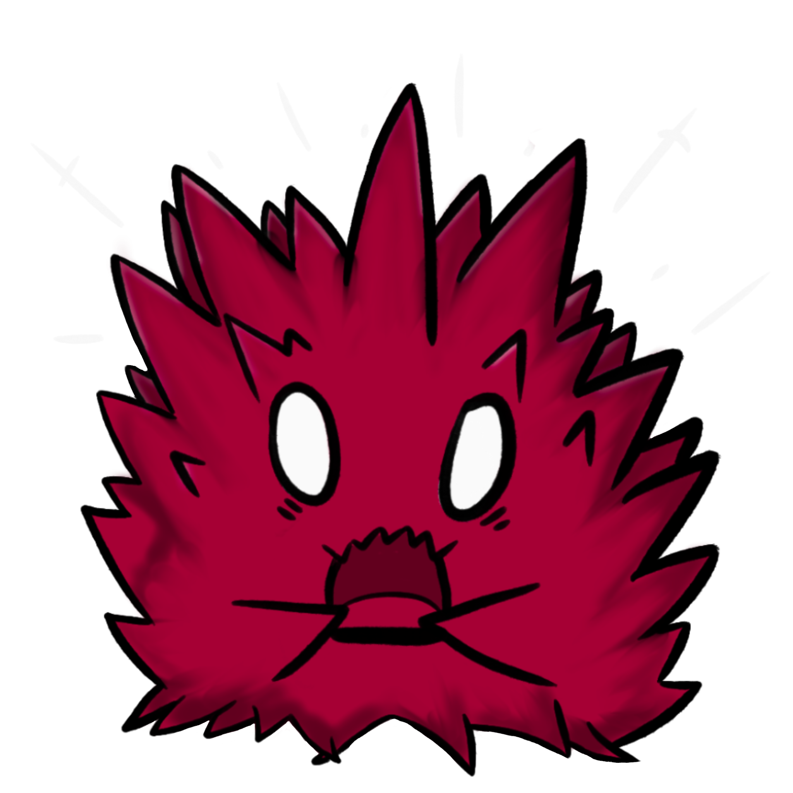
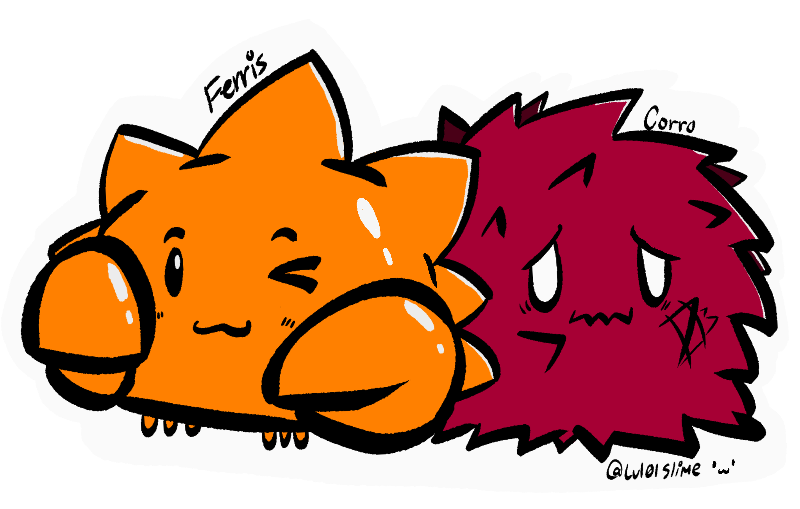
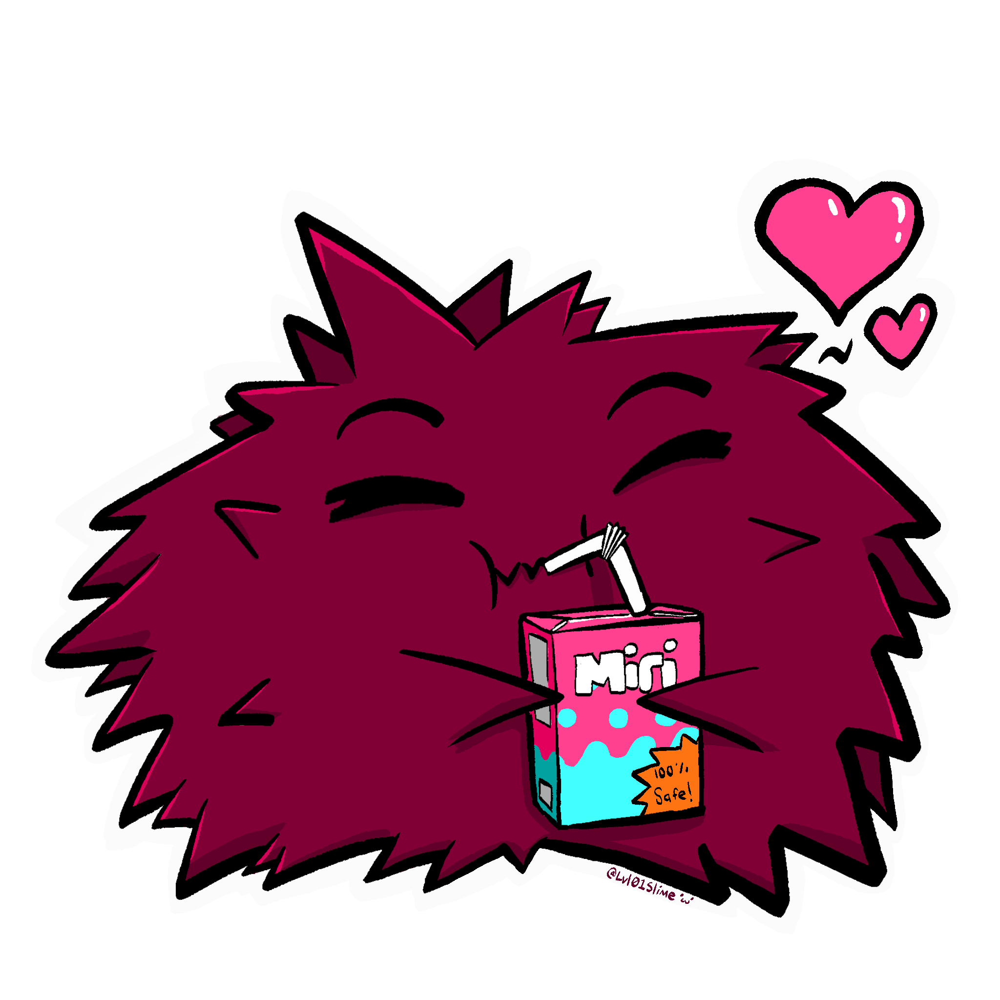

# RustWeek Artwork

The artwork in this directory was designed by Paige Losare-Lusby for RustWeek 2025 and 2026.

## License

The RustWeek artwork in this directory is
created by Paige Losare-Lusby and distributed under a
[Creative Commons Attribute-ShareAlike][CC-BY-SA] license.

[CC-BY-SA]: https://creativecommons.org/licenses/by-sa/4.0/
